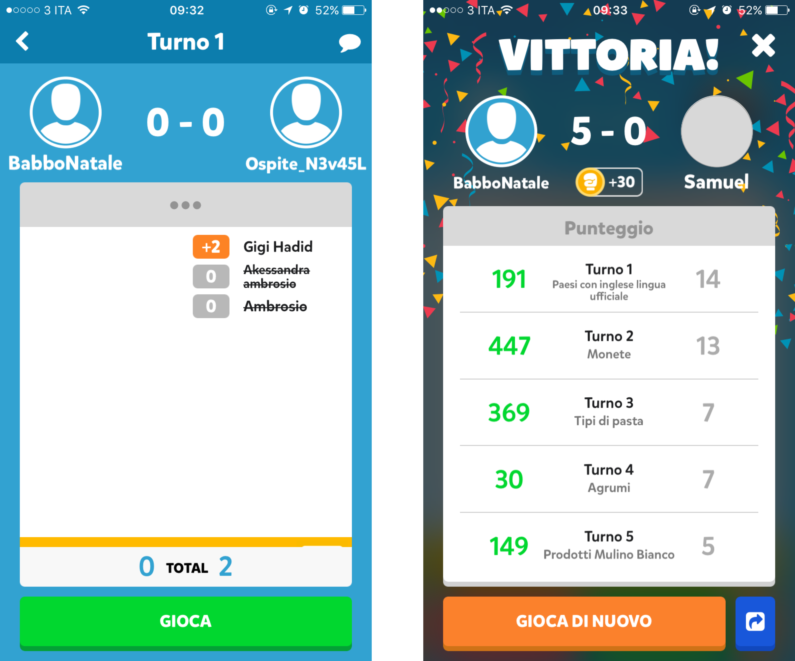

# FightList
This repository contains the source code of some cheats for the iOS version of the game "Fight List".

I wrote them in order to trigger my friends when playing against: they did their job.

## Disclaimer
> All the source code on this repository is provided for educational and informational purpose only, and should not be construed as legal advice or as an offer to perform legal services on any subject matter.
> 
> The information is not guaranteed to be correct, complete or current. 
> 
> The author (Alexandro Luongo) makes no warranty (expressed or implied) about the accuracy or reliability of the information at this repository or at any other website to which it is linked.

## Features
- Unlimited in-game currencies
- Joker button now provides 3-points answers too
- Check your opponent score before having to play
- Look at the round answers before having to play

## Screenshots

